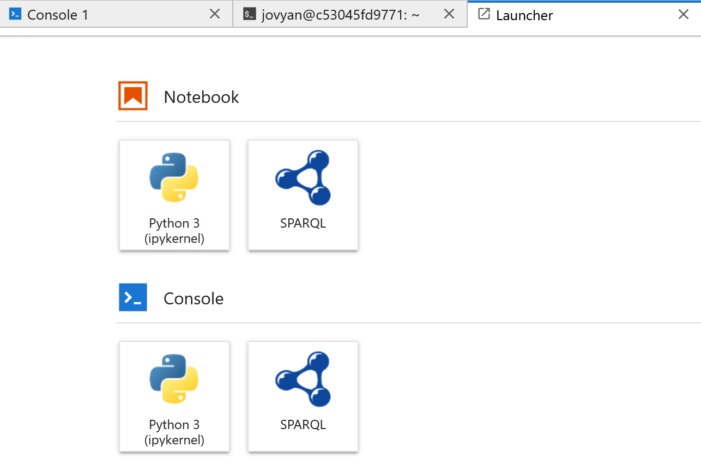
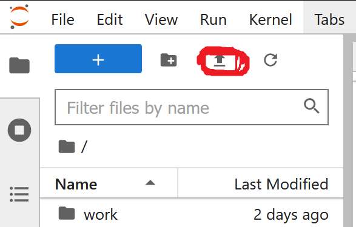

# EASE Fall School 2022 - Web Knowledge Acquisition

## Start-Up

If you haven't done so, set your environment variables (e.g. to `C:\Users\user\.local\lib\python3.8\site-packages` for pip and `C:\Users\user\.local\lib\python3.10\site-packages` for additional packages

## Start up jupyter with docker

To start up jupyter, we will use docker to start a standard jupyter notebok
1. In your shell, run `docker run -p 8888:8888 jupyter/scipy-notebook`
2. This might take a while. Wait till the container is ready
3. Open the Jupyter-Lab using the link shown in your terminal (something like http://127.0.0.1:8888/lab?token=...), it should open a tab in your browser
4. if you get a "token required" website -> disable cookies in your browser

Now you should have a blank jupyter notebook.

## Install SPARQL kernel

We are going to use a SPARQL kernel in our lectures (<i>starting at Tutorial 3, Tutorials 1 and 2 can be used without it</i>). To install this, please follow these steps:

1. In your jupyter notebook, open the terminal
2. in the terminal, run `pip install sparqlkernel`
3. Then run `jupyter sparqlkernel install --user`

If you now switch to the launcher start page, in addition to the python kernel you should now see a SPARQL kernel installed.

## Start lectures

Now let's start with the lectures!

You can either
- clone this repository using git (e.g. git bash): `git clone https://github.com/michaelakuempel/ease_fs_kg_2022.git`
or
- download the lecture files directly

In your jupyter notebook, please upload all lecture files

For Tutorials 1 and 2 you can use the python kernel, for Tutorials 3 and up you will need the SPARQL kernel.

## Run the exercises

To open the notebooks you can choose them from the left sidebar. 
You can find the first exercise in Tutorial1_Create_rdflib.ipynb, its Solution in Solution_Tut1.ipynb the second exercise in Tutorial2_Create_owlready.ipynb etc.

